# Telegram Bot using NestJs

It is a basic telegram bot that can fetch weather for you when you give the city name .It has two entities to maintain the information of users and bots .It makes use of postgres DB to user the data .

## Installation

    ```bash
    $ npm install
    ```

## Running the app

    ```bash
    $ npm start
    ```

## Scrrenshots from postman for working backend

We have Two entities user and bot to store user and bot details in Postgress DB

Some snapshots of working api calls:

### Get User

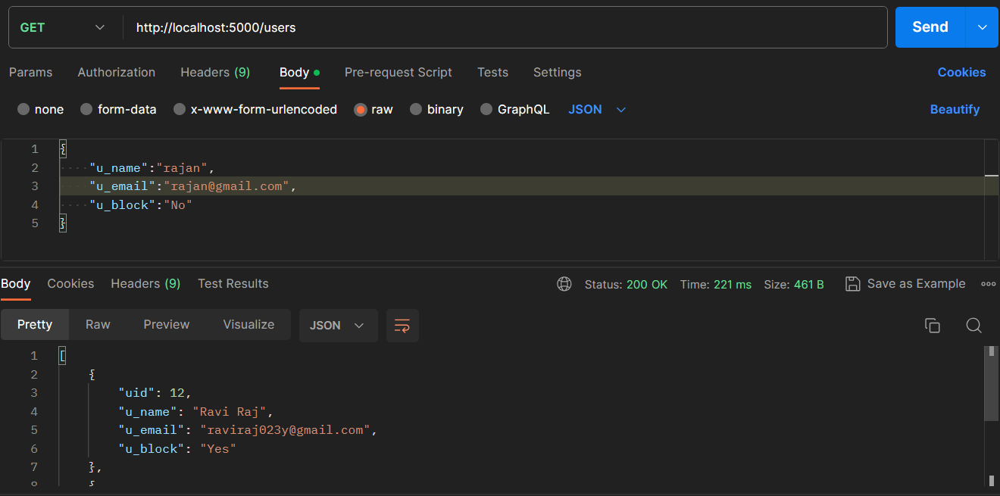


### Post User

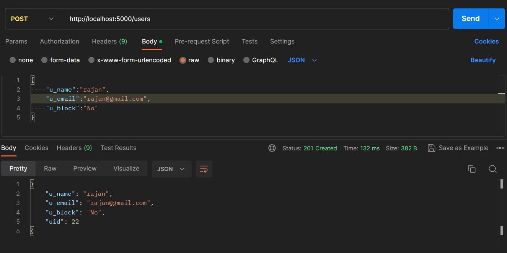

### Put User

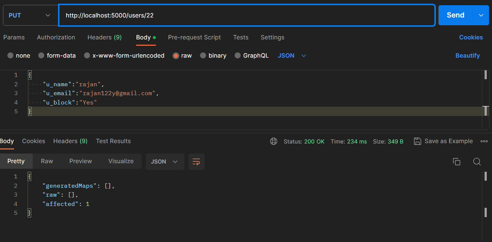
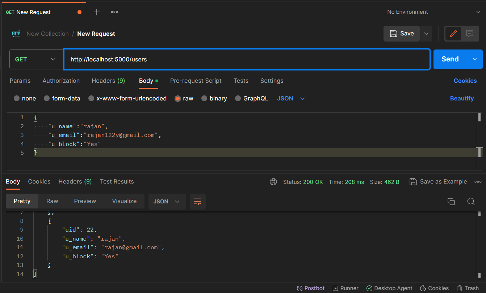


### Delete User

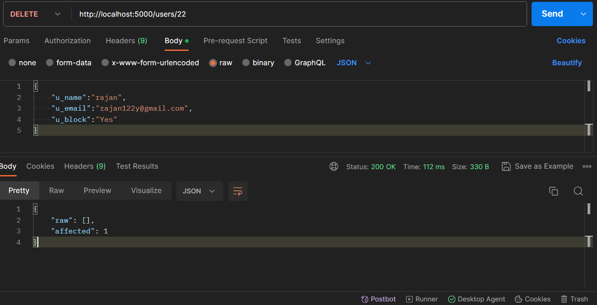

### Get Bot

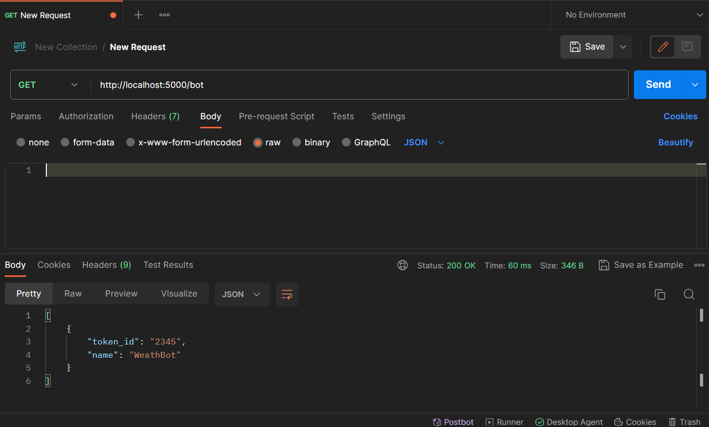

### Put Bot

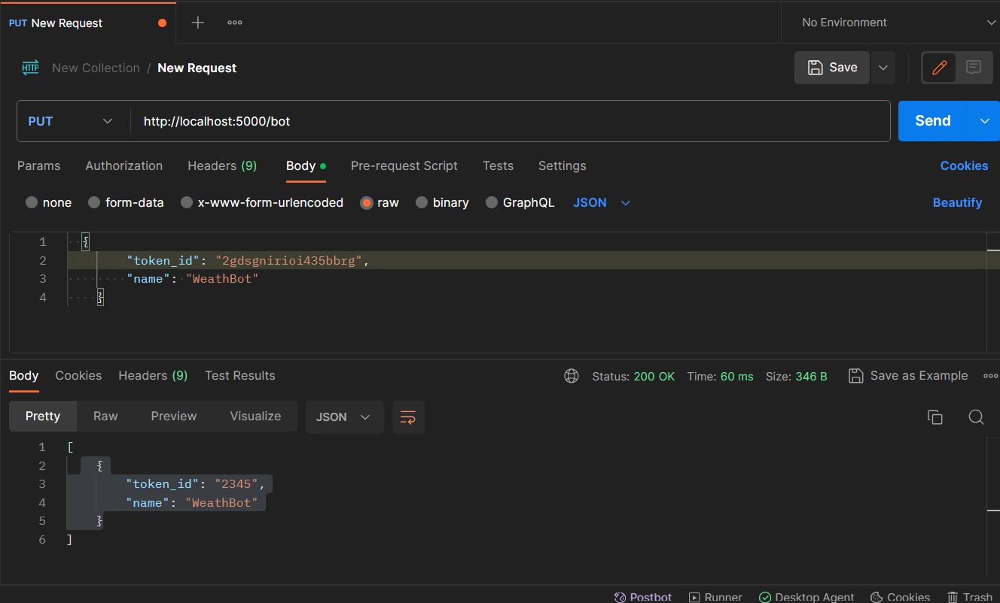

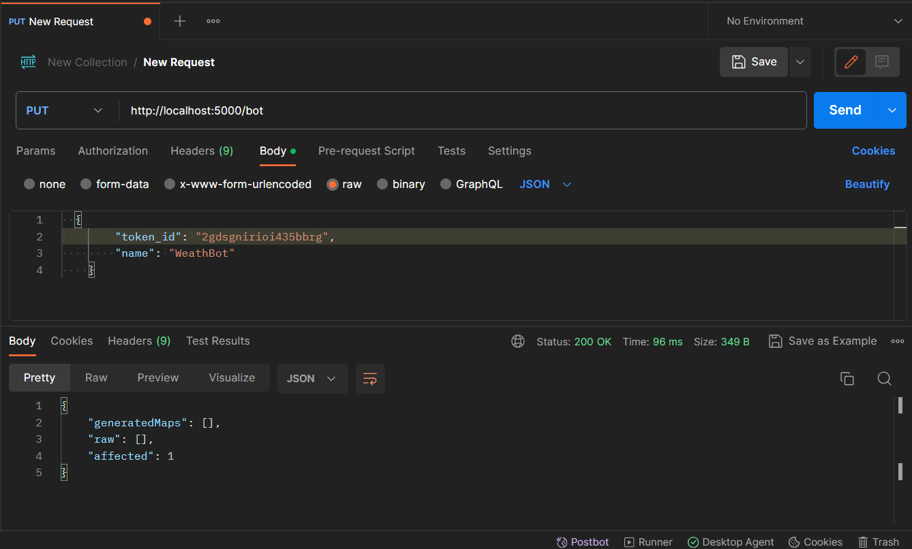

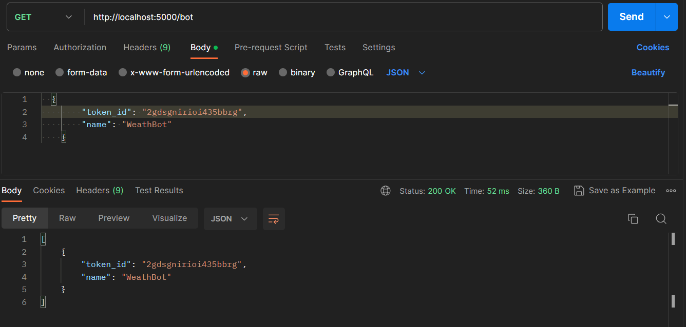

## Database

We are using Postgres DB and we are creating two tables t_user and BotDetails

### User table Creation :
    create table T_user(
    uid serial Primary key,
    u_name text,
    u_email text ,
    u_block text
    );
### Insert Query:
    INSERT INTO public.t_user(
        uid, u_name, u_email, u_block)
        VALUES (?, ?, ?, ?);

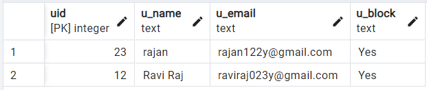


### Bot table creation:

    CREATE TABLE IF NOT EXISTS public."BotDetails"
    (
        name text COLLATE pg_catalog."default",
        token_id text COLLATE pg_catalog."default" NOT NULL,
        CONSTRAINT "BotDetails_pkey" PRIMARY KEY (token_id)
    )

### Insert Query:

    INSERT INTO public."BotDetails"(
        name, token_id)
        VALUES (?, ?);
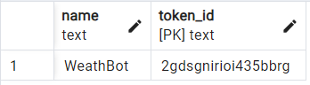

